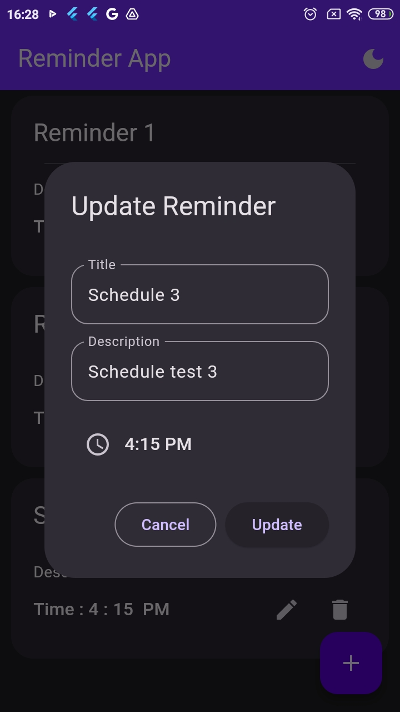
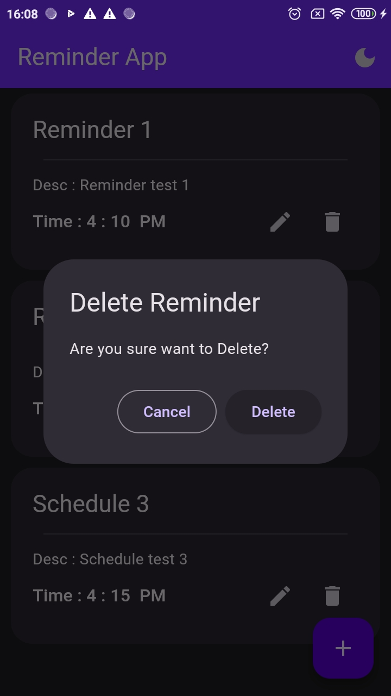

# Reminder App With Bloc

Applikasi sederhana untuk menampilkan aktifitas harian yang sudah dijadwalkan. User harus input data reminder dan set waktu yang di inginkan. sehingga app akan menampilkan notfication sesuai dengan jadwal yang sudah di setting.

## Getting Started

Untuk running project ini

Ada beberapa yang dilakukan :

- siapkan  fvm ( flutter version manager )
- setelah install, install version flutter 3.16.9
  - fvm releases
  - fvm install [version fluter]
  - fvm use [version flutter]
  - fvm flutter clean
  - fvm flutter pub get
  - fvm flutter run

## Screenshot
</img> </img></img></img></img></img></img></img></img>
